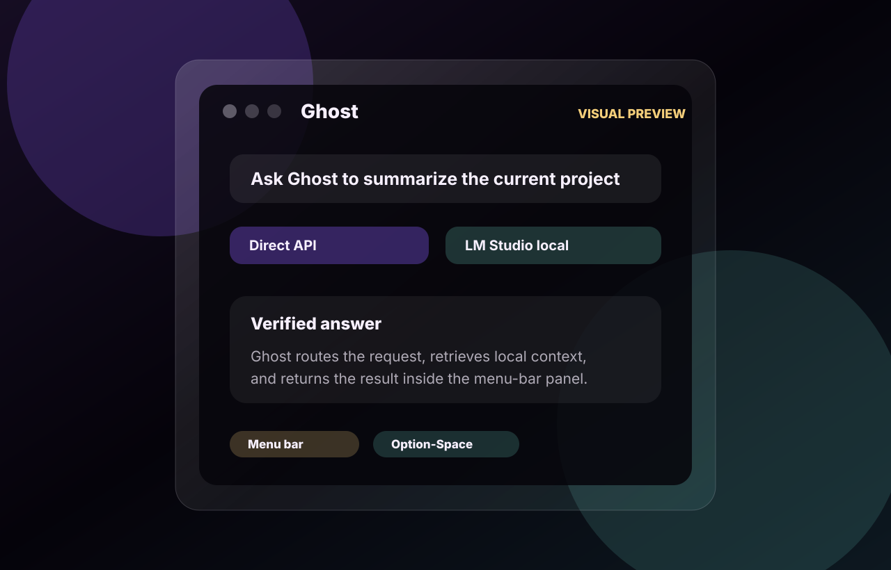
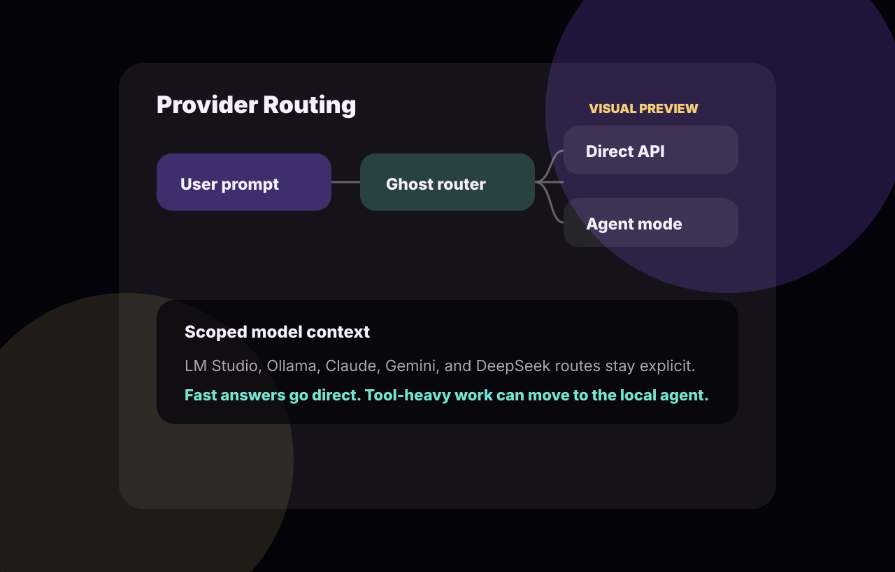
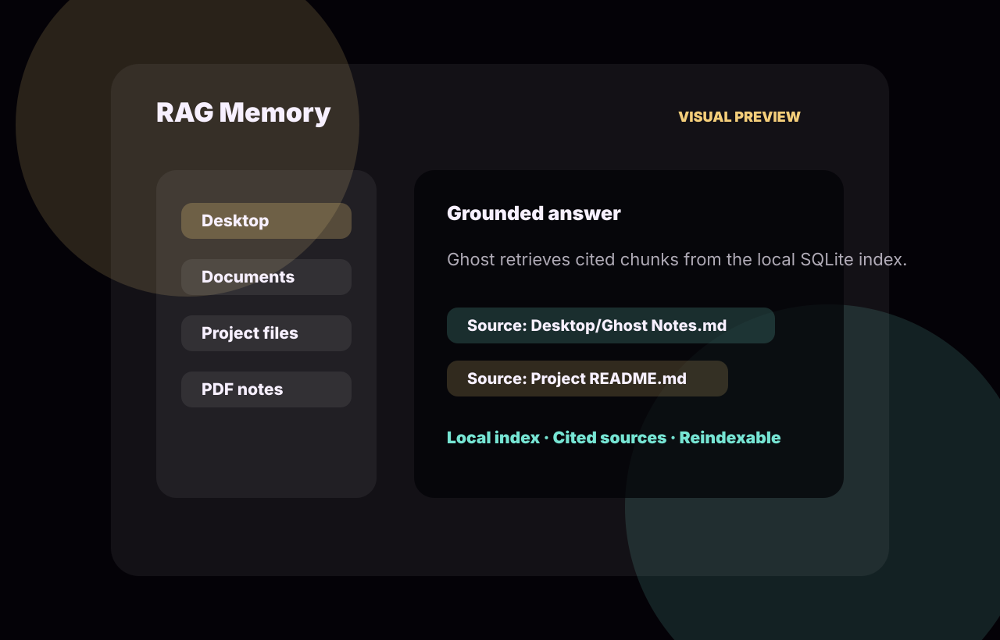
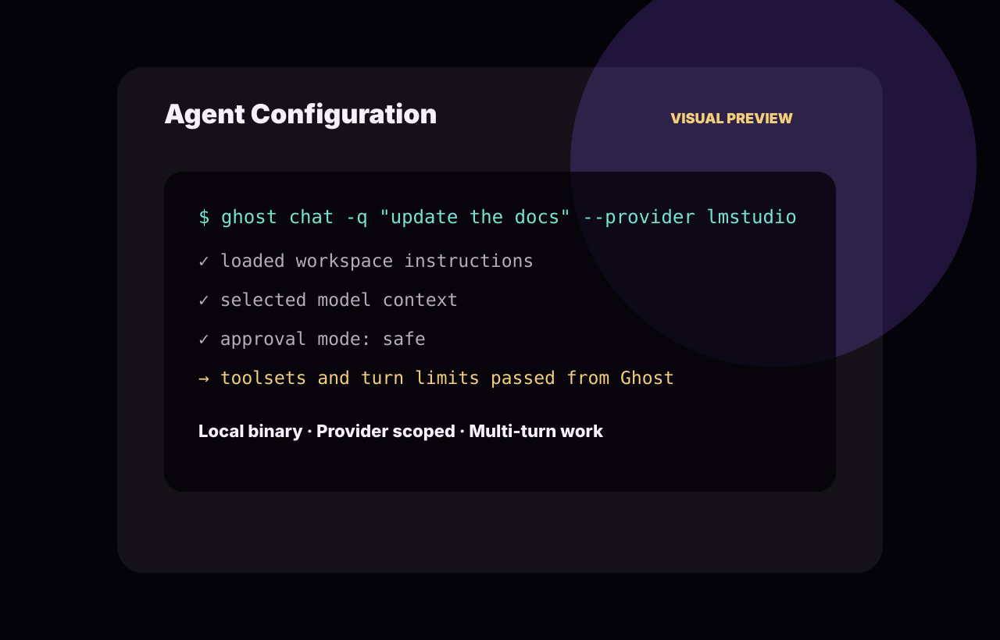
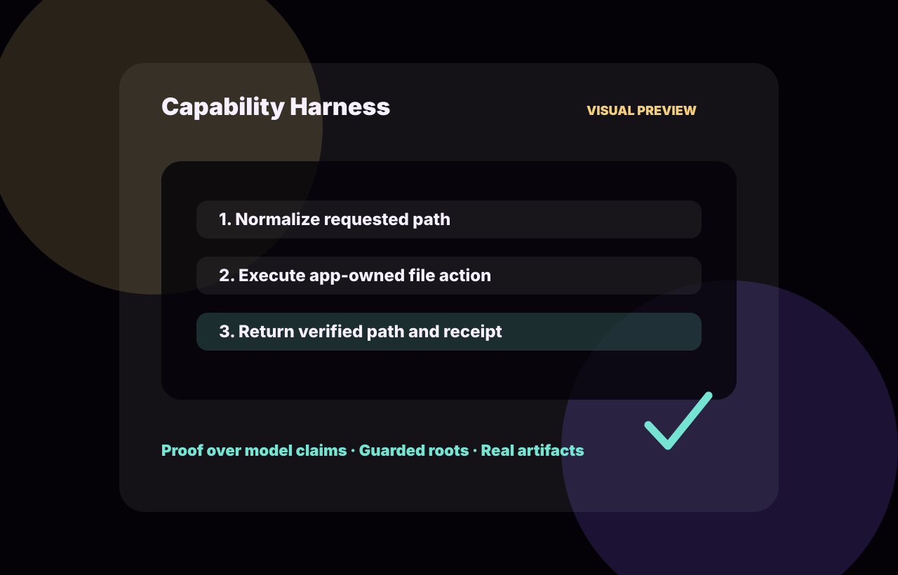
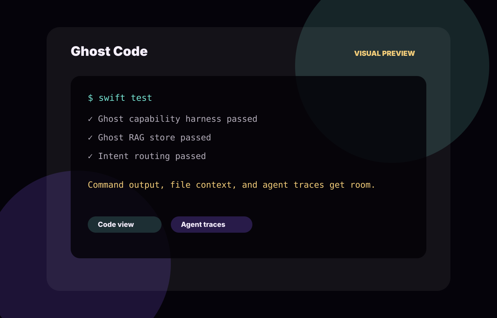

# Ghost
A premium local-first macOS AI workspace for your Mac.

## Overview

Ghost is a macOS menu-bar AI workspace that connects local models, hosted model APIs, agent CLIs, document retrieval, and verified Mac actions through one native interface. It is designed for private, fast, hands-on work: ask questions, route prompts to the right model, search your local knowledge base, create files, convert documents, and hand deeper tasks to an agent when the job needs tools.

Ghost is local-first by default. LM Studio and Ollama can run entirely from your machine, while Claude, Gemini, and DeepSeek are available when you add API keys.

## Core Features

### Model Routing

Ghost supports multiple model providers from the same app surface:

- **LM Studio** through `http://localhost:1234/v1`
- **Ollama** through `http://localhost:11434`
- **Claude** with `ANTHROPIC_API_KEY`
- **Gemini** with `GEMINI_API_KEY` or `GOOGLE_API_KEY`
- **DeepSeek v4** with `DEEPSEEK_API_KEY`

The app includes two execution engines:

- **Direct API** for fast provider calls and lightweight tool use.
- **Ghost Agent** for deeper multi-turn work through a local agent CLI.

In automatic mode, Ghost routes simple questions to Direct API and sends tool-heavy, coding, file, or personal-action tasks to the agent path when appropriate.

### Agent Connection

Ghost can connect to local command-line agents and launch them with the selected provider/model context. The supported local agent kinds in the app are:

- **Ghost Agent**, expected at `~/.local/bin/ghost`
- **Hermes Agent**, expected at `~/.local/bin/hermes`

Agent mode is intended for tasks that need multi-step reasoning, files, command execution, or a broader workspace loop. Ghost passes provider selection, model selection, turn limits, approval mode, and optional toolsets into the agent process.

### RAG System

Ghost includes a local retrieval system backed by SQLite. It can ingest files and folders, store searchable document chunks, query the index, open source files, reindex content, remove documents, and report index status.

Supported document and source-code formats include:

```text
txt, md, markdown, html, htm, pdf, docx, epub, csv, json, rtf,
swift, py, js, ts, tsx, jsx, java, cpp, c, h, hpp, m, mm,
sql, xml, yaml, yml, toml, log
```

By default, Ghost stores the RAG database under:

```text
~/Library/Application Support/Ghost/rag/ghost_rag.sqlite
```

### Capability Harness

Ghost uses a capability harness so model-requested actions are executed by app-owned code instead of being treated as model claims. The harness validates paths, checks permissions, runs the action, and returns the real result.

Current harness capabilities include:

- File discovery, reading, writing, moving, copying, trashing, and folder creation
- Markdown, HTML, TXT, CSV, JSON, PDF, DOCX, PPTX, and XLSX creation
- Text and Markdown conversion into PDF, DOCX, HTML, TXT, or Markdown
- RAG ingestion, sync, query, chunk search, status, reindexing, and clearing
- Finder open/reveal actions
- Reserved higher-risk shell and patch operations that require approval paths

## How Ghost Works

1. You open Ghost from the macOS menu bar or with the global shortcut.
2. Ghost receives the prompt, selected provider, selected model, and engine preference.
3. The router chooses Direct API or Agent mode.
4. If the prompt needs local knowledge, Ghost can query the RAG index.
5. If the prompt needs an action, the capability harness performs and verifies the action.
6. Ghost returns the response with the app's actual execution result.

## Requirements

- macOS 14 or newer
- Swift 6.1-compatible toolchain
- Xcode or Xcode Command Line Tools
- Optional: Xcode beta at `/Applications/Xcode-beta.app/Contents/Developer`; the build script uses it automatically when available
- Optional local model runtime: LM Studio or Ollama
- Optional hosted provider keys for Claude, Gemini, or DeepSeek
- Optional local agent CLI at `~/.local/bin/ghost` or `~/.local/bin/hermes`

Some actions require macOS permissions such as Apple Events, microphone, speech recognition, Calendar, or Reminders access.

## Installation

Clone the repository:

```bash
git clone https://github.com/ryuhemingway/Ghost-App.git
cd Ghost-App
```

Build the Swift package:

```bash
swift build
```

Build and launch the macOS app bundle:

```bash
./script/build_and_run.sh
```

The build helper creates:

```text
dist/Ghost.app
```

Useful script modes:

```bash
./script/build_and_run.sh --debug
./script/build_and_run.sh --logs
./script/build_and_run.sh --telemetry
./script/build_and_run.sh --verify
```

## Configuration

Ghost stores provider secrets in:

```text
~/.ghost/.env
```

Common provider variables:

```text
ANTHROPIC_API_KEY=
GEMINI_API_KEY=
GOOGLE_API_KEY=
DEEPSEEK_API_KEY=
OPENAI_API_KEY=
OPENAI_BASE_URL=
```

For local models:

- Start LM Studio's local server at `http://localhost:1234` before selecting LM Studio models.
- Start Ollama at `http://localhost:11434` before selecting Ollama models.
- Ghost discovers local model lists from the configured local endpoints.

For agent mode:

- Install or symlink the Ghost agent CLI to `~/.local/bin/ghost`, or Hermes to `~/.local/bin/hermes`.
- Choose the agent engine in Ghost when a task needs files, tools, approvals, or multi-turn work.

## Usage

### Launch Ghost

Run:

```bash
./script/build_and_run.sh
```

Ghost runs as a menu-bar app. The global panel shortcut is `Option+Space`.

### Choose a Model

Open Ghost and select a provider/model. Use LM Studio or Ollama for local inference, or choose Claude, Gemini, or DeepSeek after configuring the matching API key.

### Ask Questions

Use Direct API mode for fast questions, short writing tasks, summaries, and simple coding help.

### Use Agent Mode

Use Ghost Agent mode when a request needs workspace context, file edits, command-line tools, approval handling, or longer multi-step work.

### Add Documents to RAG

Use the RAG actions in Ghost to ingest a file or sync a folder. Once indexed, ask questions against your local documents and source files.

### Use Local Actions

Ask Ghost to create files, convert documents, search indexed files, open sources, reveal items in Finder, or create structured outputs. The capability harness performs the action and reports the verified result.

## Screenshots

Native Ghost screenshots require an interactive macOS session with the app permissions granted. Until those are captured, the repo includes polished Ghost app visual previews based on the current product surface and supported capabilities.













When real app screenshots are captured, place them under `docs/screenshots/app/` and replace the preview links above.

## Project Structure

```text
Sources/Ghost/
  App/                  App entry points and menu-bar wiring
  Helpers/              Shared helper utilities
  Models/               Provider, engine, and app data models
  Resources/            Bundled app resources
  Services/             Provider APIs, secrets, RAG, harness, and integrations
  Stores/               App state stores
  Views/                SwiftUI interface
Tests/GhostTests/       Swift tests
script/build_and_run.sh macOS build, launch, logs, telemetry, and verify helper
docs/                   Secondary static marketing/gallery demo
```

## Development

Run tests:

```bash
swift test
```

If your active command-line tools cannot build the app, use Xcode beta explicitly:

```bash
DEVELOPER_DIR=/Applications/Xcode-beta.app/Contents/Developer swift test
```

Verify the app bundle launches:

```bash
./script/build_and_run.sh --verify
```

## Troubleshooting

### Local models do not appear

Confirm the local server is running:

```bash
curl http://localhost:1234/v1/models
curl http://localhost:11434/api/tags
```

Then reopen Ghost and refresh the provider/model picker.

### Hosted provider requests fail

Check `~/.ghost/.env` for the matching key. Claude uses `ANTHROPIC_API_KEY`, Gemini uses `GEMINI_API_KEY` or `GOOGLE_API_KEY`, and DeepSeek uses `DEEPSEEK_API_KEY`.

### Agent mode does not start

Confirm the agent binary exists and is executable:

```bash
ls -l ~/.local/bin/ghost
ls -l ~/.local/bin/hermes
```

Use Direct API mode for local LM Studio or Ollama requests when provider isolation blocks agent launch.

### RAG results are missing

Ingest or sync the folder again, check RAG status, and make sure the file type is supported. Large folder syncs can take time, especially on the first pass.

### macOS permissions block an action

Open System Settings and grant Ghost the permission requested by macOS. Some integrations require Apple Events, Calendar, Reminders, microphone, or speech recognition access.

## Website / Gallery

This repo also includes a static interactive website in `docs/` for showcasing Ghost app capabilities. It is a secondary gallery surface, not the main macOS app.

Run it locally:

```bash
python3 -m http.server 4173 --directory docs
```

Then open:

```text
http://127.0.0.1:4173
```

See `docs/README.md` for the gallery-specific usage notes and screenshots.
