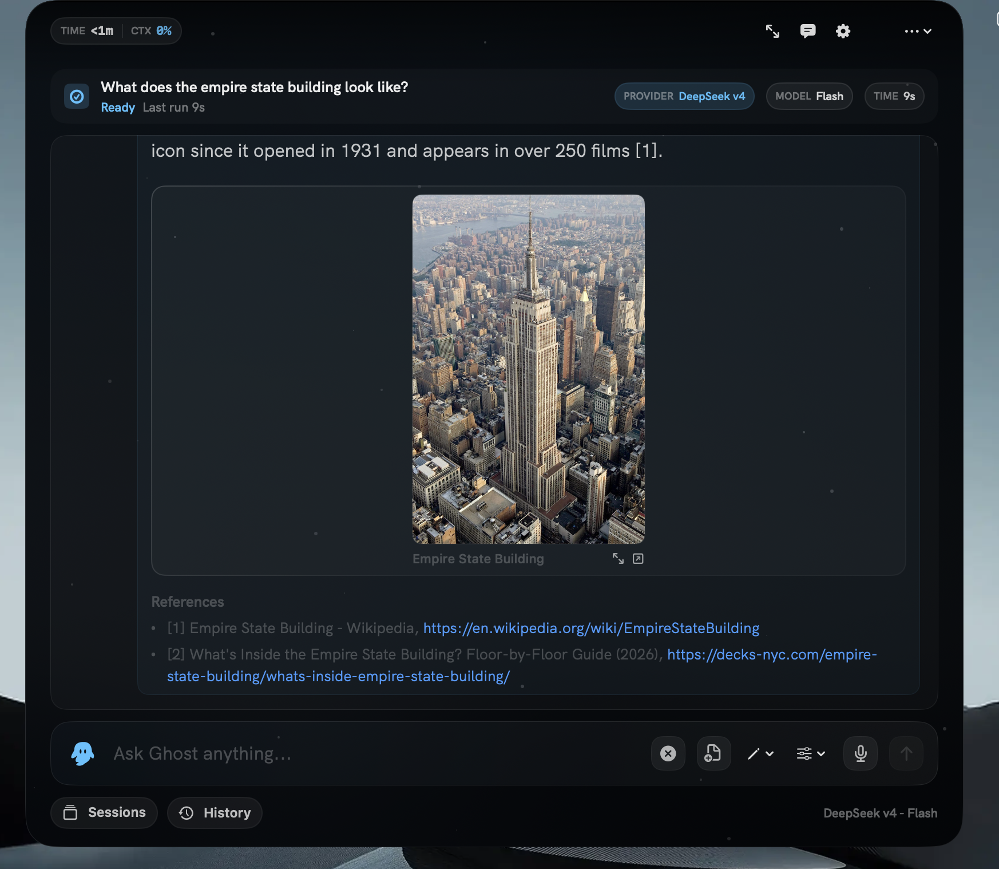
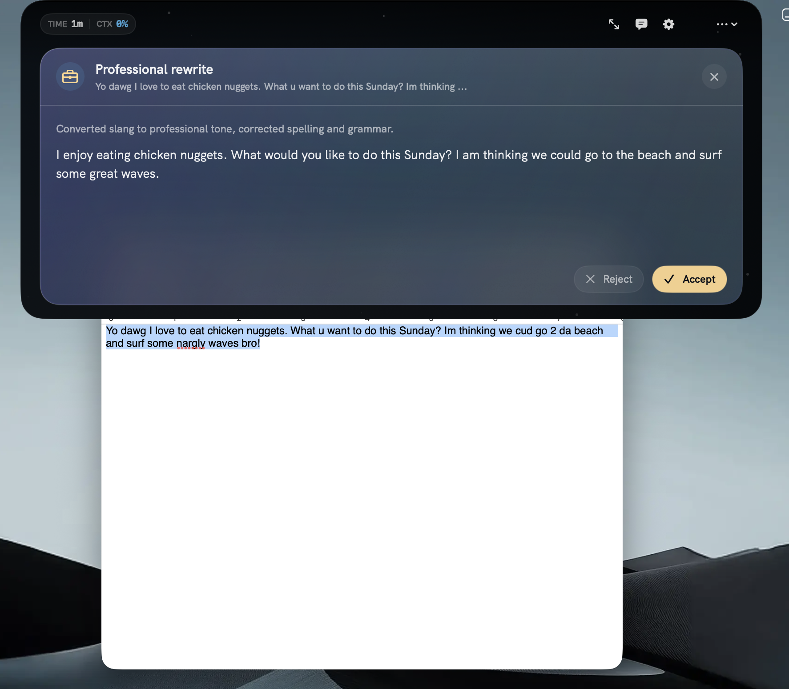
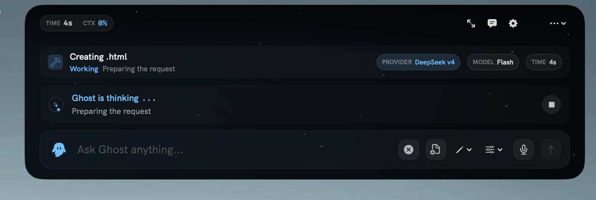
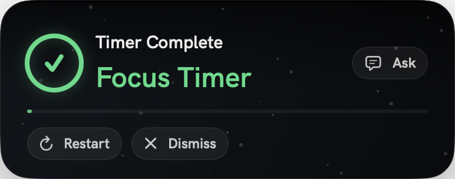
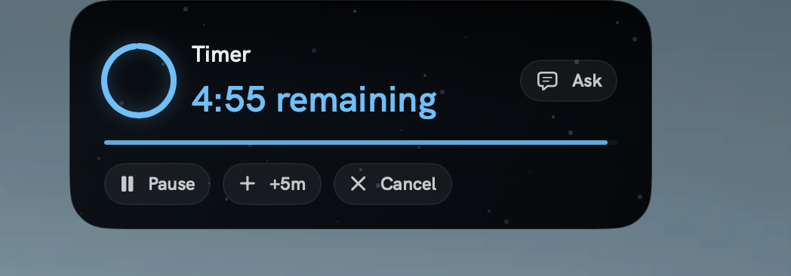
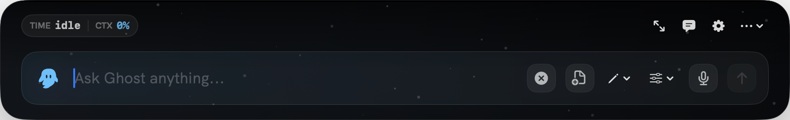
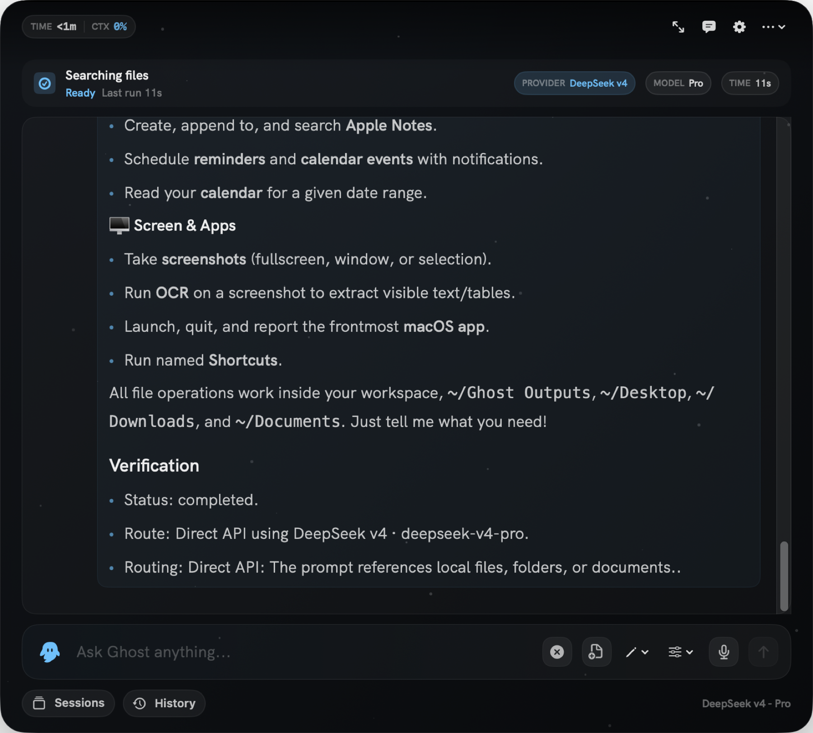
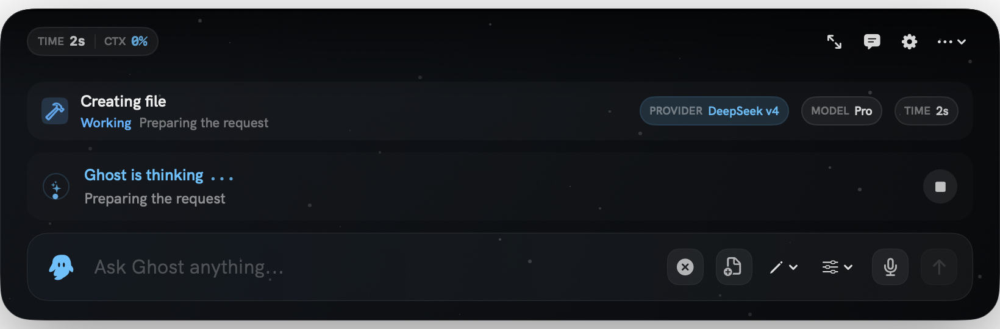
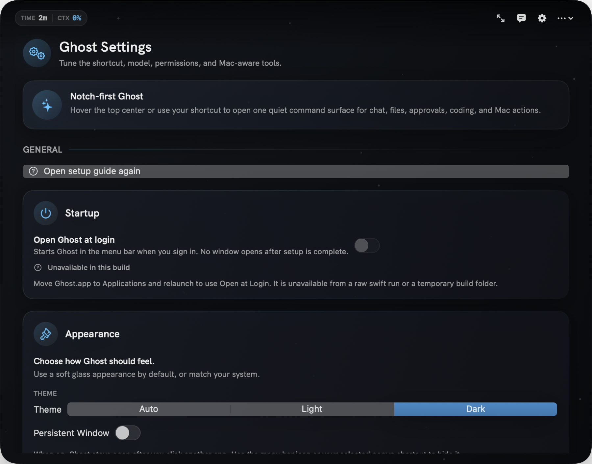

# Ghost

A premium local-first macOS AI workspace for your Mac.

## Overview

Ghost is a macOS menu-bar AI workspace that connects local models, hosted model APIs, optional agent CLIs, document retrieval, timers, and verified Mac actions through one native notch-first interface. It is designed for private, fast, hands-on work: ask questions, route prompts to the right model, search your local knowledge base, create files, convert documents, start focus sessions, and run Ghost-managed tools directly from provider APIs.

Ghost is local-first by default. LM Studio and Ollama can run entirely from your machine, while Claude, Gemini, DeepSeek, OpenCode Go, and OpenCode Zen are available when you add API keys.

## Highlights

- **Notch-first command surface** — `⌥Space` opens one top-center Ghost surface for chat, file work, approvals, settings, history, and live task state. It expands only as much as the current job needs.
- **Quick suggestions** — the notch header includes a suggestion button next to Settings so users can send short product feedback without leaving Ghost.
- **Agent Console** — `⌘⇧T` opens Ghost's in-app work console and activity surface without launching a separate terminal app.
- **Timers & focus sessions** — natural-language timer requests are handled locally. The compact notch shows a countdown, completed timers pop back open, and controls include pause, resume, +5m, restart, cancel, and dismiss.
- **Premium HUD** — tabular numerals, latency sparkline, token counter ticker, champagne bloom on success, reasoning depth meter on every response, skeleton loaders instead of spinners.
- **Verified Desktop artifacts** — file-generation prompts can land in the workspace, Ghost Outputs, Desktop, Downloads, or Documents, with safer fallback handling when a model returns a code block instead of a native file tool call.
- **Reactive aurora** — the surface background hue shifts with the conversation tone (code = cyan, emotional = warm champagne, creative = orchid). A 1.6s spring cross-fade, deliberately long so the user feels it before they see it.
- **Readable working states** — live task strips now use stable labels such as "Ghost is thinking" and "Ghost is using tools" with fixed ellipses, clearer provider/model/time pills, and less layout jitter.
- **Refreshed settings** — Settings are grouped into General, AI, and Advanced areas, with cleaner cards, access controls, startup state, appearance settings, and local agent setup.
- **Usage & Cost dashboard** — `⌘⇧U` opens a full-screen sheet with today's spend, 30-day sparkline, per-model breakdown, and recent activity. Approximates cost from a per-model rate table; the free tier shows $0.00.
- **Voice input sheet** — the mic button opens a 3-bar EQ waveform with live transcript. Bars driven by RMS from the audio tap so they react to your voice, with a synthetic oscillator so they never freeze between words.
- **Radial context menu** — right-click any message for a circular menu: Copy / Regenerate / Fork / Pin / Copy ID / Delete. The selected action is highlighted champagne; the destructive action is red.
- **Cheatsheet** — `⌘/` opens a Spotlight-style overlay of every keyboard shortcut with a search field.
- **Welcome-back confetti** — once per day, a small champagne spark bursts from the Ghost logo when Ghost summons.
- **Predictive suggestions** — three contextual prompts above the empty composer.
- **Today recap** — sessions, tokens, avg latency, and a daily sparkline on the empty-state surface.

## Screenshots


_Ghost opens from the menu bar with one keystroke — chat, route models, search files, and run Mac actions from a single notch-first surface._


_Ghost Code agent mode: Plan, Build, Explore, and Review. Here the Build agent creates a solar system animation and writes it to the Desktop._


_Local RAG: Ghost indexes your folders with FTS5 full-text search and returns source-backed chunks with file paths you can open directly._


_Seven providers, two execution engines, four effort levels, and three approval modes — route every prompt to the right model._


_Natural-language timers and focus sessions run locally. The compact notch shows a countdown, and completed timers pop back open with controls._


_Verified Desktop artifacts: Ghost creates real files — HTML, PDF, DOCX, Markdown, and more — using native macOS frameworks._

[View the generated solar system demo](docs/media/solar-system-demo.html)


_Type or dictate a question, attach files or images, and watch the answer stream inline._


_Answers stream token-by-token with provider, model, and routing details visible in the transcript._


_Files are created through the verified tool harness — the model requests, Ghost executes and confirms._


_Settings grouped into General, AI, and Advanced with independent permission switches for every capability._

### Showcase Videos

<video src="docs/media/ghost-showcase-main.mp4" controls muted loop width="100%"></video>
_Main Ghost workflow showcase_

<video src="docs/media/ghost-showcase-notch.mp4" controls muted loop width="100%"></video>
_Ghost notch workflow showcase_

---

## Core Features

### Model Routing

Ghost supports multiple model providers from the same app surface:

- **LM Studio** through `http://localhost:1234/v1`
- **Ollama** through `http://localhost:11434`
- **Claude** with `ANTHROPIC_API_KEY`
- **Gemini** with `GEMINI_API_KEY` or `GOOGLE_API_KEY`
- **DeepSeek v4** with `DEEPSEEK_API_KEY`
- **OpenCode Go** with `OPENCODE_API_KEY`
- **OpenCode Zen** with `OPENCODE_ZEN_API_KEY` (curated models, includes free tier)

The app includes two execution engines:

- **Direct API** for fast provider calls with Ghost-managed harness tool calling.
- **Ghost Agent** for optional external-agent workflows through a local agent CLI.

In automatic mode, Ghost uses Direct API as the primary path, including files, documents, RAG, coding edits, Mac actions, Notes, Shortcuts, Calendar, Reminders, screenshots, and safe command inspection through the built-in harness. Agent mode is optional.

### Agent Connection

Ghost can connect to local command-line agents and launch them with the selected provider/model context. The supported local agent kinds in the app are:

- **Ghost Agent**, expected at `~/.local/bin/ghost`
- **Hermes Agent**, expected at `~/.local/bin/hermes`

Agent mode is optional and exists for users who deliberately want to route work through a local Ghost/Hermes-style agent process. Ghost passes provider selection, model selection, turn limits, approval mode, and optional toolsets into that agent process.

### RAG System

Ghost includes a local retrieval system backed by SQLite. It can ingest files and folders, store searchable document chunks, query the index, open source files, reindex content, remove documents, and report index status.

Supported document and source-code formats include:

```text
txt, md, markdown, html, htm, pdf, docx, epub, csv, json, rtf,
swift, py, js, ts, tsx, jsx, java, cpp, c, h, hpp, m, mm,
sql, xml, yaml, yml, toml, log
```

By default, Ghost stores the RAG database under:

```text
~/Library/Application Support/Ghost/rag/ghost_rag.sqlite
```

### Capability Harness

Ghost uses a capability harness so model-requested actions are executed by app-owned code instead of being treated as model claims. The harness validates paths, checks permissions, runs the action, and returns the real result.

Current harness capabilities include:

- File discovery, reading, writing, moving, copying, trashing, and folder creation
- Markdown, HTML, TXT, CSV, JSON, PDF, DOCX, PPTX, and XLSX creation
- Text and Markdown conversion into PDF, DOCX, HTML, TXT, or Markdown
- RAG ingestion, sync, query, chunk search, status, reindexing, and clearing
- Finder open/reveal actions
- Reserved higher-risk shell and patch operations that require approval paths
- Text-artifact fallback for OpenAI-compatible providers: if a model answers with a usable HTML/Markdown/TXT/CSV/JSON code block instead of calling a file tool, Ghost can save it to the requested safe destination and return the real path. If a model claims a file was saved without a verified write, Ghost treats that as an error instead of silently trusting the claim.

### Ghost Notch & Timers

Press the Ghost shortcut (`⌥Space` by default, configurable in Settings) anywhere in macOS and a frosted glass surface opens from the top center. Type or dictate a question, attach files or images, watch the answer and tool activity stream inline, and expand into the transcript when you need more room. Escape dismisses the surface.

Timer and focus-session requests are deterministic and local. Ask for "a 20 minute focus timer" or "remind me to check the oven in 10 minutes" and Ghost starts a notch countdown without calling a model. Active timers take over the compact notch, completed timers reopen with a haptic, and the expanded timer card exposes pause, resume, +5m, restart, cancel, and dismiss.

The optional Ghost Bar shortcut (`⌥⇧Space` by default) still reuses the full Ghost pipeline — routing, deterministic parsers, harness tools, and streaming — for quick asks from the active screen.

### Command Palette & Navigation

The notch header keeps common destinations close: expand transcript or history, ask, settings, and the compact overflow menu. Session history now includes an empty state, count badge, clear-sessions confirmation, and richer provider/model/time pills.

In the full app surface, `⌘K` opens the command palette — the hub for switching provider or effort, inserting recent/saved prompts, running quick actions, and jumping to destinations such as New Chat, History, Document Studio, Prompt Library, Settings, Telemetry, Export to Markdown, Clear Chat, and Ghost Bar.

Other shortcuts:

- `⌥Space` — toggle the Ghost notch (registered as a real Carbon hotkey — no Accessibility permission needed, works while Ghost is frontmost)
- `⌥⇧Space` — summon the Ghost Bar (configurable)
- `⌘Return` — send / stop
- `⌘,` — settings
- `⌘⇧K` — clear conversation
- `⌘D` — toggle dictation
- `Escape` — dismiss the notch or Ghost Bar

The notch becomes key when summoned, so you can type immediately; the menu-bar icon also has a right-click menu (Open Ghost, Ghost Bar, New Chat, Check for Updates, Quit).

### Design & Experience

Ghost has a cohesive "cosmic glass" identity in the default Ghost Glass mode:

- **Living aurora background** that reacts to what Ghost is doing — a slow violet drift at idle, cooler cyan turbulence while thinking or working, and a one-time champagne bloom when a run completes. Backed by a real `NSVisualEffectView` blur so surfaces read as lit glass, with a subtle noise layer to keep gradients clean.
- **Signature summon** — the notch condenses into view (scale + blur + bloom) with a matched trackpad haptic, and another gentle haptic when an answer completes.
- **State-reactive send button** — quiet and hollow when empty, filled with the primary accent when there's something to send, and a red stop control while a run is in flight.
- **Answer arrival** — answers open with a serif display lead-in and each block eases in from a soft blur, so replies feel like they precipitate into place.
- **Ghost Code routing** — deeper coding and file tasks show live progress in the notch while Ghost works through the native tool harness.

All motion respects the system **Reduce Motion** accessibility setting.

### Performance & Reliability

- **Prompt caching (Claude)** — the large, stable tool + system prefix is marked with an ephemeral cache breakpoint, and request bodies serialize deterministically, so repeated turns reuse the cached prefill instead of paying for it every time.
- **Streaming everywhere** — Claude streams token-by-token _through the tool loop_ (you see the answer forming while tools run), and other Direct API providers stream where supported.
- **Resilient tool runs** — a failing tool (dead link, missing file) returns a structured error to the model and the run continues instead of aborting; runs that hit the round budget still finalize with a real answer; transient 429/5xx provider errors retry with backoff.
- **Warm local models** — Ollama requests keep the model resident between turns (`keep_alive`) to avoid cold-load latency.

## What You Can Use Ghost For

Ghost is meant to be useful from the first keystroke, whether you want a quick answer or a verified Mac action.

- **Ask fast questions from anywhere** — open the notch, type a question, dictate it, or attach an image. Ghost routes the request to the selected provider and shows provider/model/time context while it works.
- **Write, rewrite, and review text** — draft replies, rewrite selected text professionally or casually, check grammar, ask for feedback, or copy polished output back into the app you were already using.
- **Work with files and documents** — ask Ghost to create or edit files, save Markdown/HTML/TXT/CSV/JSON, convert content into PDF/DOCX/PPTX/XLSX, reveal files in Finder, and report the verified path it actually wrote.
- **Search your local knowledge** — ingest documents or folders into the local RAG index, then ask cited questions against notes, PDFs, course material, source files, exported docs, and project folders.
- **Use local or hosted models** — run fully local with LM Studio or Ollama, or use Claude, Gemini, DeepSeek, OpenCode Go, and OpenCode Zen after adding provider keys.
- **Run Ghost-managed tools safely** — Ghost's native harness checks capability switches, path boundaries, web egress rules, and approval mode before executing model-requested actions.
- **Handle Mac tasks** — create Calendar events, schedule Reminders, inspect screenshots with OCR, open apps or Shortcuts when explicitly requested, and keep these capabilities opt-in under Privacy & Access.
- **Stay focused with timers** — start focus timers and short reminders in natural language. Timers are deterministic and local, with notch countdowns and controls.
- **Inspect commands deliberately** — run direct shell commands that you explicitly request, with shell access governed separately from local files and Mac automation.
- **Track usage and cost** — review today's spend, recent latency, per-model usage, and daily activity in the Usage & Cost dashboard.
- **Send quick product suggestions** — use the suggestion button beside the notch Settings cog to send a short note to the developer.

## How Ghost Works

1. You open Ghost from the macOS menu bar or with the global shortcut.
2. Ghost receives the prompt, selected provider, selected model, and engine preference.
3. The router chooses Direct API by default, or Agent mode when you explicitly prefer the optional agent path.
4. If the prompt needs local knowledge, Ghost can query the RAG index.
5. If the prompt needs an action, the capability harness performs and verifies the action. Deterministic timers are handled locally before provider routing.
6. Ghost returns the response with the app's actual execution result.

## Download

Get the latest release from GitHub:

**[Download Ghost](https://github.com/ryuhemingway/Ghost-App/releases/latest)**

- Requires macOS 14 or newer
- Apple-notarized — safe to download and install
- Some features require macOS permissions (Calendar, Reminders, microphone, speech recognition) which are requested only when you first use them

### First-run privacy

Fresh installs start with every capability turned off — clipboard, web access, local files, Mac automation, screen capture, shell, and RAG indexing. Setup lets you opt into each one individually. Disabled tools are removed from model requests and double-checked before execution. Full-disk path scope is a separate advanced setting, never enabled by default.

## Configuration

Ghost stores API keys in the **macOS Keychain**. Open **Settings → API Keys** in the app to add or update provider keys.

Supported keys:

```text
ANTHROPIC_API_KEY
GEMINI_API_KEY (or GOOGLE_API_KEY)
DEEPSEEK_API_KEY
OPENCODE_API_KEY
OPENCODE_ZEN_API_KEY
```

For local models, start the server before selecting the provider:

- **LM Studio** — starts at `http://localhost:1234`
- **Ollama** — starts at `http://localhost:11434`

## Usage

### Launch Ghost

Download and install from [GitHub Releases](https://github.com/ryuhemingway/Ghost-App/releases/latest). Ghost runs as a menu-bar app. The global notch shortcut is `Option+Space`.

### Choose a Model

Open Ghost and select a provider/model. Use LM Studio or Ollama for local inference, or choose Claude, Gemini, DeepSeek, OpenCode Go, or OpenCode Zen after configuring the matching API key.

### OpenCode Zen (free tier)

OpenCode Zen is a curated list of models hosted by the OpenCode team. After saving your `OPENCODE_ZEN_API_KEY` under **Settings → API Keys**, open the provider picker and switch to **OpenCode Zen**, then click **Refresh OpenCode Zen Models** to sync the available model list. The free tier currently includes:

- **Big Pickle** (stealth free model, time-limited)
- **DeepSeek V4 Flash Free**
- **MiMo-V2.5 Free**
- **North Mini Code Free**
- **Nemotron 3 Ultra Free**

Free models are surfaced alongside paid models; pick any from the synced list. Ghost routes the model through `https://opencode.ai/zen/v1/chat/completions` with the same Direct API harness as every other provider.

### Ask Questions

Use Direct API mode for fast questions, writing tasks, summaries, coding help, files, documents, RAG, Mac actions, Notes, Shortcuts, Calendar, Reminders, screenshots, and other Ghost-managed harness tools.

Examples:

```text
Who won the 2018 FIFA World Cup?
Rewrite this professionally.
Summarize @README.md and tell me the risky parts.
Create a one-page PDF study guide and save it to Desktop.
Search my indexed notes for refund policy language.
OCR the selected screen area and turn any table into Markdown.
Set a 25 minute focus timer.
Create a calendar event tomorrow at 2pm for project review.
```

### Use Agent Mode

Use Ghost Agent mode only when you deliberately want the optional external-agent runtime instead of Ghost's built-in Direct API harness.

### Add Documents to RAG

Use the RAG actions in Ghost to ingest a file or sync a folder. Once indexed, ask questions against your local documents and source files.

### Use Local Actions

Ask Ghost to create files, convert documents, search indexed files, open sources, reveal items in Finder, or create structured outputs. The capability harness performs the action and reports the verified result.

### Send Suggestions

Open the notch and click the suggestion button next to the Settings cog to send a short note to the developer.

## Troubleshooting

### Local models do not appear

Confirm the local server is running:

```bash
curl http://localhost:1234/v1/models
curl http://localhost:11434/api/tags
```

Then reopen Ghost and refresh the provider/model picker.

### Hosted provider requests fail

Verify your API key is set correctly in Ghost Settings → API Keys. Keys are stored in macOS Keychain. Claude uses `ANTHROPIC_API_KEY`, Gemini uses `GEMINI_API_KEY` or `GOOGLE_API_KEY`, DeepSeek uses `DEEPSEEK_API_KEY`, OpenCode Go uses `OPENCODE_API_KEY`, and OpenCode Zen uses `OPENCODE_ZEN_API_KEY`.

### Agent mode does not start

Confirm the agent binary exists and is executable:

```bash
ls -l ~/.local/bin/ghost
ls -l ~/.local/bin/hermes
```

Use Direct API mode for local LM Studio or Ollama requests. Provider isolation keeps local-model work inside Ghost's managed Direct API tool loop unless you explicitly configure an agent backend.

### RAG results are missing

Ingest or sync the folder again, check RAG status, and make sure the file type is supported. Large folder syncs can take time, especially on the first pass.

### macOS permissions block an action

Open System Settings and grant Ghost the permission requested by macOS. Some integrations require Apple Events, Calendar, Reminders, microphone, or speech recognition access.

## Contributing

See [CONTRIBUTING.md](CONTRIBUTING.md) for project structure, build instructions, and development setup.
