<div align="center">

https://github.com/user-attachments/assets/ef881143-3b65-491d-b78b-1be007a04c9b

<sub>One sentence to Ghost, and `milky-way.html` is written to the Desktop and opens in Safari. 26 seconds, no cuts. ([download](docs/media/demo-milky-way.mp4))</sub>

<br/>

[](https://github.com/ryuhemingway/Ghost-App/releases/latest)

<br/>

<a href="https://integratedagentics.com/ghost"></a>

<samp>v3.0.0 · notarized · one-time purchase · macOS 14+</samp>

</div>

<br/>

Every AI tool today has the same problem: you're the one doing all the context switching. ChatGPT tab, local model UI, terminal agent, document viewer, timer app, Calendar, Reminders — seven surfaces just to get through a focused hour of work. Ghost replaces all of them with one surface that lives in your menu bar and opens with ⌥Space.

So you type a question, attach a file, dictate a note, or start a focus timer — and Ghost routes it to the right model (local or cloud, or your own Claude/ChatGPT plan), searches your indexed documents, remembers what matters about you, creates real files, runs verified Mac actions, and drops back out of sight. No Dock icon, no tab management, no full-screen takeover. Just the work, done.

By default, everything is off: web access, file tools, automation, messaging, screen capture, shell. You opt in one switch at a time. API keys live in your Keychain; if Ghost finds one in `~/.ghost/.env` or the environment it moves it there and strips the file. Local models run entirely on your machine with the same tool harness the cloud models get. And your most personal data — Messages, Notes, Mail, Contacts — is processed **on device only**: Ghost never sends it to a cloud model on its own initiative, and when you deliberately act on a selection from one of those apps, it tells you where the text is going first. It also reads the selection itself before a cloud action runs, and says so if it looks like you are about to send a card number, a Social Security number, or a passport number.

<br/>

## New in 3.0.0

Ghost could always read text off your screen, and it could never look at a picture you handed it. Both of those changed.

- **⌘V a screenshot straight into the chat bar.** Take a screenshot, press ⌘V in Ghost, ask your question. The image rides along with the message and Ghost answers about what is in it, in the notch and in the floating bar alike. Pasting an image used to do nothing at all, silently, while pasting text worked perfectly — a hard thing to report as a bug and an easy one to assume was never a feature. Ordinary text paste behaves exactly as before.
- **Your subscription can look at images too.** On a Claude or ChatGPT subscription Ghost used to refuse an attached image and tell you to switch to an API key and a vision model. That advice was wrong: the model at the other end of your subscription reads images perfectly well. Ghost now hands the picture over in a way that route can accept, and gives it the means to open it, so you get a real answer instead of a redirect.
- **Reading your screen no longer takes a minute.** The first screen read after a macOS update could take the better part of a minute, even for two words, and every one after it was instant. That was macOS loading its text recognizer rather than Ghost thinking: about 55 seconds the first time and about a tenth of a second every time after, whatever the words say. Ghost now wakes the recognizer quietly when it starts, so nobody waits for it. A screen read also finishes the moment the words are on screen rather than holding on for an optional cleanup pass, and a short blurry read no longer spends a network round trip to be handed its own guess back.
- **Asking for your screen is the same as pressing the button.** Typing "read my screen" used to be sent off to a model that had to decide to go and look, which is a round trip for something your Mac does on its own. It now runs the same instant capture the button does. Only for asking flatly for the screen: a question that needs an answer as well as the words, like why an error is happening, still goes to the model where it belongs.

<br/>

## One surface, eight providers, zero context switching.

<sub><samp>⌥SPACE · ANYWHERE ON MACOS</samp></sub>

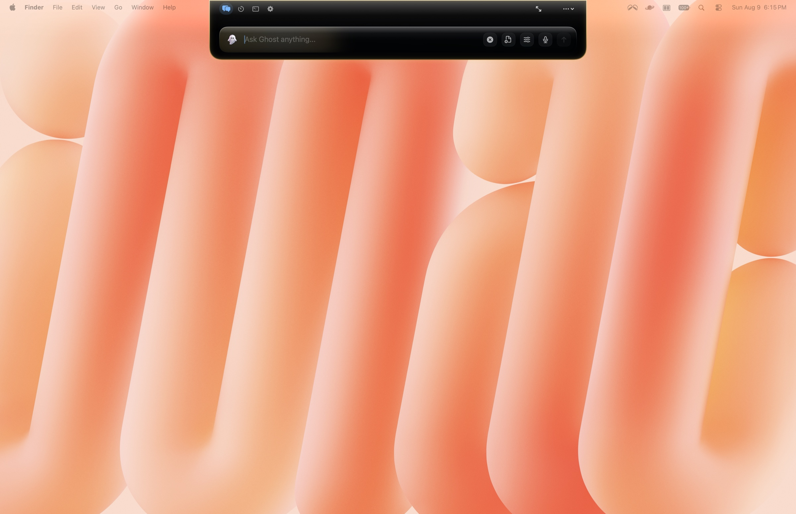

Press ⌥Space anywhere on your Mac and a frosted-glass surface appears — dropping from the camera notch, or floating up as a text bar near the bottom of the screen, your choice. Chat, file creation, document search, memory, timers, Calendar, Reminders, Notes, screen OCR, and agent coding sessions all live in one place. The aurora background shifts hue with the tone of your conversation. On a notch Mac you can also reveal it by gliding your pointer to the top-center of the screen. Escape dismisses it, and typing a single `/` lists every command Ghost understands.

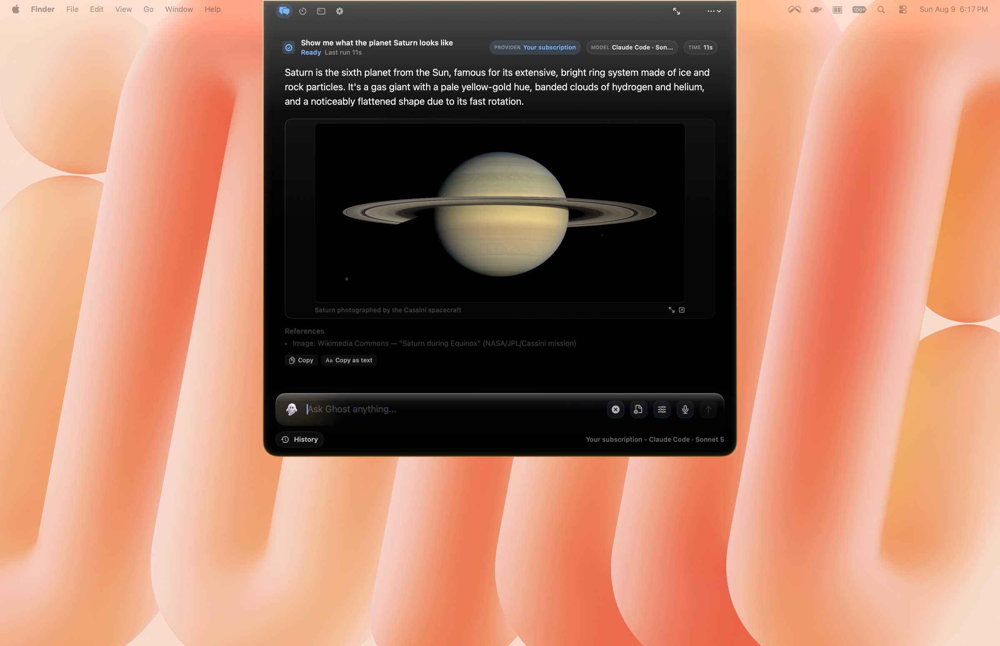

Ghost routes every prompt through an intent classifier that detects what you're actually trying to do — Answer, Research, Files, Summarize, Screenshot, Clipboard, Create, Organize, Automation, Messages, Code, Debug, Review, Shell — then picks the right provider and model. Choose from eight providers — **LM Studio** and **Ollama** (fully local), **Claude**, **Gemini**, **DeepSeek**, **OpenCode Go**, **OpenCode Zen**, and any **OpenAI-compatible** server — or run chat on your own **Claude Code**, **Codex**, or **Antigravity** subscription. Local models get probed on first launch for tool-calling capability and assigned the safest calling convention they can handle, so even models that can't do native function calls still get the harness.

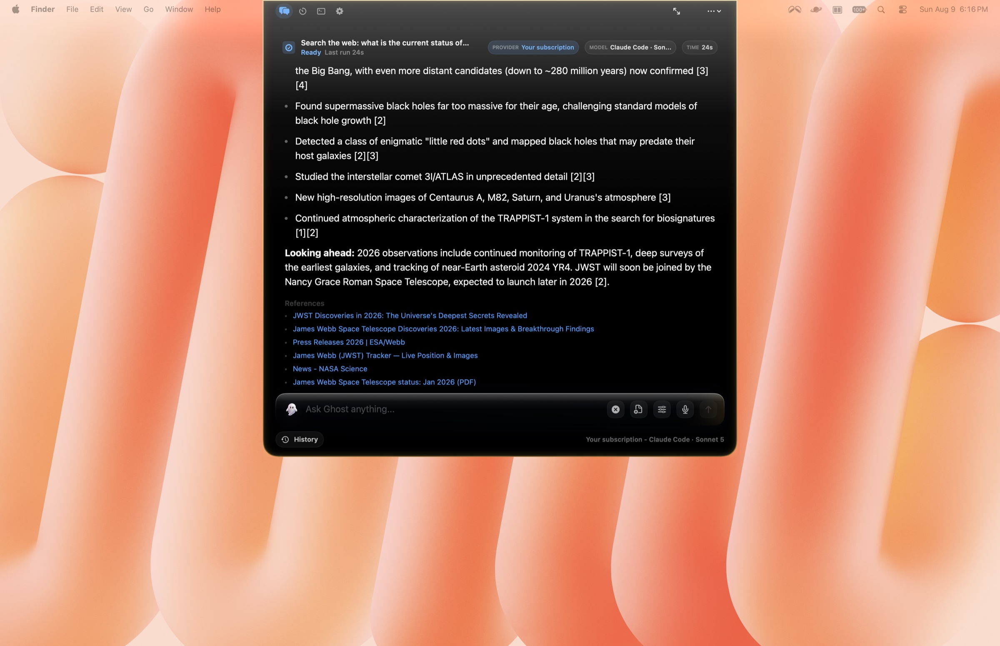

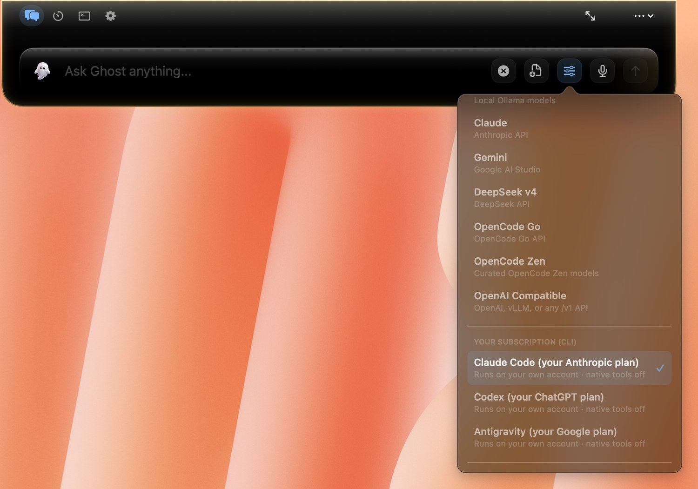

Both of these ran on **gemma-4-e2b through LM Studio** — no API key, no network, the full tool harness:

https://github.com/user-attachments/assets/9557b25e-e938-41a0-bf67-2d22c5fbf3eb

<sub>A local model answering with no API key and no network. 20 seconds. ([download](docs/media/demo-golden-retriever-local.mp4))</sub>

https://github.com/user-attachments/assets/15af610b-9b94-49ce-898e-ab093aa3b2bb

<sub>The same local model on a coding question. 26 seconds. ([download](docs/media/demo-java-for-loop-local.mp4))</sub>

And the same surface on a subscription route, working a physics problem and then answering the follow-up:

https://github.com/user-attachments/assets/6ff1858e-2e97-47a3-84da-19be47c4111f

<sub>Kinematics worked step by step, then the follow-up: "how can I memorize them?" 47 seconds. ([download](docs/media/demo-kinematic-equations.mp4))</sub>

<br/>
<br/>

## Ghost remembers you.

<sub><samp>ON-DEVICE KNOWLEDGE BASE · PLAIN MARKDOWN YOU OWN</samp></sub>

Tell Ghost "remember that I take my coffee black" or "my sister's name is Mara," and it saves a durable fact to a personal knowledge base. From then on it quietly grounds your chats with what it knows — no re-explaining yourself every session. Ask "what do you know about me?" to see it all.

It isn't a black box: your knowledge base is plain Markdown at `~/Ghost Outputs/Knowledge`. Read it, edit it, or delete a note anytime. Nothing about you is stored on a server.

<br/>

## Your files, searched locally. No cloud. No embeddings API. No vector DB SaaS.

<sub><samp>SQLITE + FTS5 · 30+ FORMATS · FSEVENTS SYNC</samp></sub>

Ghost indexes folders you approve into a local SQLite database with FTS5 full-text search — 3,500-character chunks with 500-character overlap, sentence-aware splitting, page numbers from PDFs, section titles from Markdown. A desktop watcher keeps everything in sync with an 8-second debounce. Queries return source-backed chunks with file paths; Ghost opens the exact file at the right line.

30+ formats: txt, md, html, pdf, docx, epub, csv, json, rtf, and every major programming language. Everything stays on your machine.

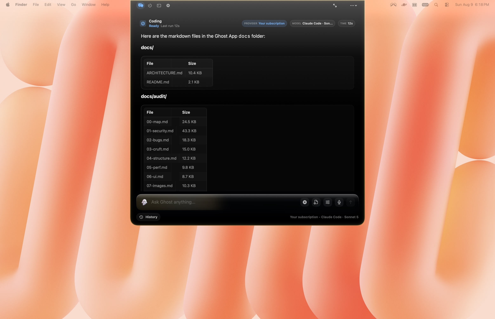

<br/>

## Real files, not chat bubbles.

<sub><samp>DOCX · PDF · PPTX · XLSX · MARKDOWN · HTML · CSV · JSON</samp></sub>

Ask Ghost to create a file and it writes one — not a code block you copy-paste out of a chat window. Native macOS frameworks generate DOCX, PDF, PPTX, XLSX, Markdown, HTML, CSV, and JSON. Files land in your workspace, Ghost Outputs, Desktop, Downloads, or Documents, and every produced document is listed in Document Studio so you can find it again. Every write is verified; if a model claims a file was saved without a confirmed write, Ghost treats that as an error instead of silently trusting it.

The Milky Way visualisation at the top of this page is one of these: a single sentence, and `milky-way.html` is on the Desktop and opens in Safari.

[View the generated solar system demo](docs/media/solar-system-demo.html)

<br/>

## Nearly eighty tools, four risk tiers, one undo journal.

<sub><samp>THE MODEL NEVER TOUCHES YOUR FILESYSTEM</samp></sub>

The capability harness is Ghost's action layer. The model requests an action; Ghost normalizes the path, checks permissions, runs app-owned Swift code, and returns a machine-readable receipt. **76 tools** span file operations, document generation and conversion, web search and fetch, Calendar events, Reminders, Apple Notes, iMessage and FaceTime, screen capture with Vision OCR, on-device voice input, memory, and a full suite of Mac controls.

Every tool is classified into four risk tiers — Low (read-only), Medium (writes/creates), High (patches/deletes/shell), and Blocked (unknown tools fail closed). An action journal records before-and-after state so you can roll back what Ghost changed. A created or edited file, a folder, any generated document, an Apple Note, a reminder, a calendar event, and an app Ghost opened or quit are each one tap of **Undo** away, right on the action card in the transcript. Two actions are outside the journal on purpose: uninstalling an app and clearing junk both move things to the Trash rather than deleting them, so recovery is Finder's **Put Back**, and the card says so instead of offering an Undo it cannot honour. Six independent permission switches (web, files, automation, messaging, screen, terminal) are all off by default and toggle independently, with three approval modes — Ask, Safe, and Auto-run.

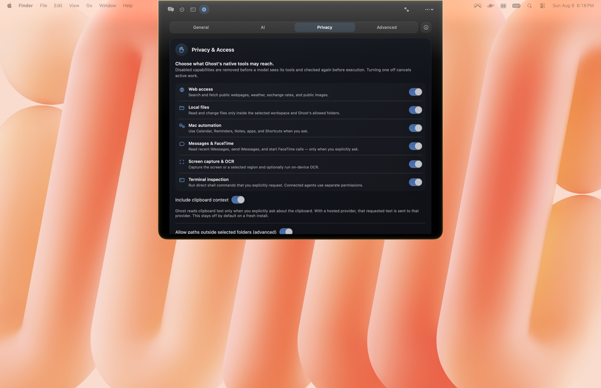

<br/>

## Runs your Mac, not just your prompts.

<sub><samp>ON-DEVICE · DETERMINISTIC · APPROVAL-GATED WHEN IT MATTERS</samp></sub>

Ask Ghost to actually _do_ things on your Mac. A live **system report** covers CPU, memory, disk, battery health and cycles, chip temperatures, and top processes. Quick actions toggle Dark Mode, set brightness, switch audio devices, mute the mic, empty the Trash, keep the Mac awake, lock the screen, and reveal hidden files. It snaps and tiles windows, manages Homebrew, uninstalls apps completely (with their caches and preferences), scans and clears junk (dry-run first), converts and compresses media, picks a screen color, and runs any macOS Shortcut.

And for anything no built-in tool covers, **computer-use** kicks in: Ghost writes an AppleScript for the task and runs it _only_ after you review and approve the exact script — nothing executes until you say yes.

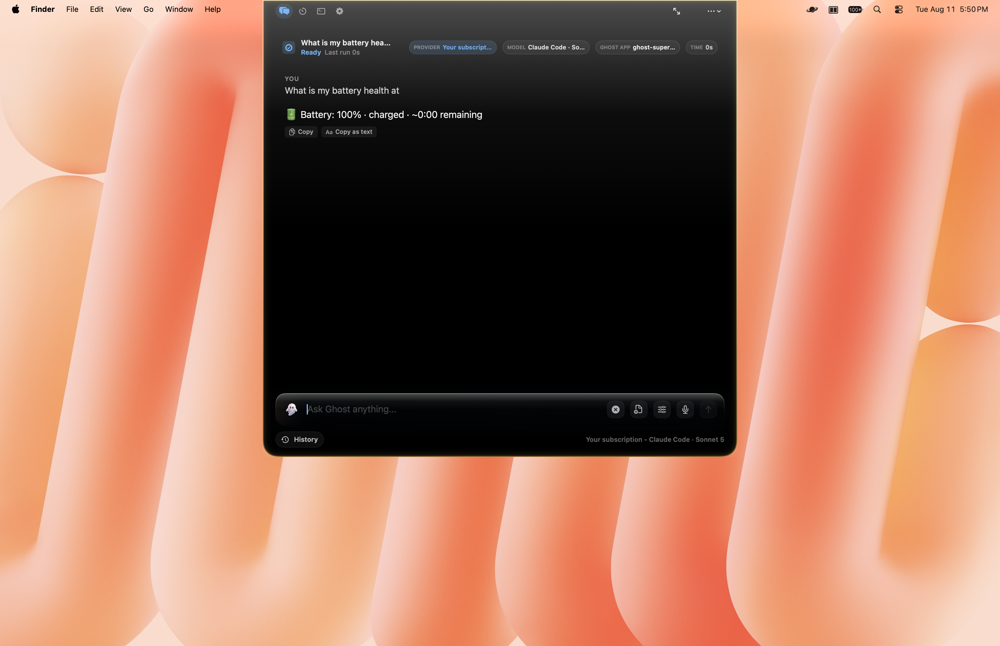

<br/>

## Your day, handled.

<sub><samp>DAILY BRIEF · REMINDERS · CALENDAR · NOTES</samp></sub>

Ask "what's on my plate?" and Ghost returns a ranked daily brief — overdue and upcoming Reminders plus imminent Calendar events, in one glance. Create reminders and events in plain language ("remind me to call the dentist Thursday at 10"), make and append to Apple Notes, and search your notes on-device. Ghost can also quietly prepare proactive suggestions from what's due — but it never fires them on its own.


<br/>

## Messages, Notes, and calls — on device, by design.

<sub><samp>YOUR PERSONAL DATA NEVER TOUCHES A CLOUD MODEL</samp></sub>

Ghost reads recent iMessages, sends texts, and starts FaceTime calls — after you confirm the recipient and message. It searches your Apple Notes and can read your Contacts to match "Mom" to the right number. This is the most personal data on your Mac, so Ghost draws a hard line: **Messages, Notes, Mail, and Contacts are processed on-device only and are never sent to any cloud model** — not for answers, not for memory, not for tools. To use them with AI at all, pick a local model (LM Studio or Ollama). Messaging is off by default and reading iMessages requires Full Disk Access.

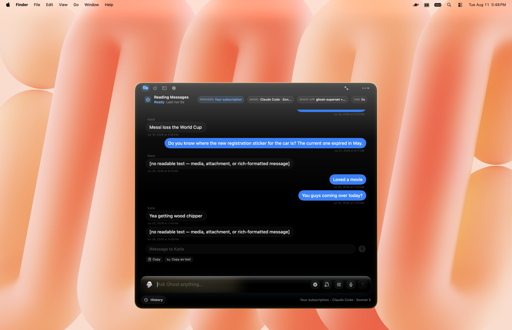

<br/>

## A pomodoro that keeps the receipts.

<sub><samp>FOCUS · BREAK · LONG BREAK · AND THE RECORD OF ALL OF IT</samp></sub>

Ask for "a 25 minute focus timer" or "remind me to check the oven in 10 minutes" and Ghost starts a countdown right there — deterministic, local, no model inference. Anything that counts as focus time runs as a pomodoro phase: name the subject, and Ghost runs the cycle for you, starting the break itself and reaching for the long break every fourth session. Controls are pause, +5m, skip and stop; active timers take over the compact surface and finished ones reopen with a trackpad haptic.

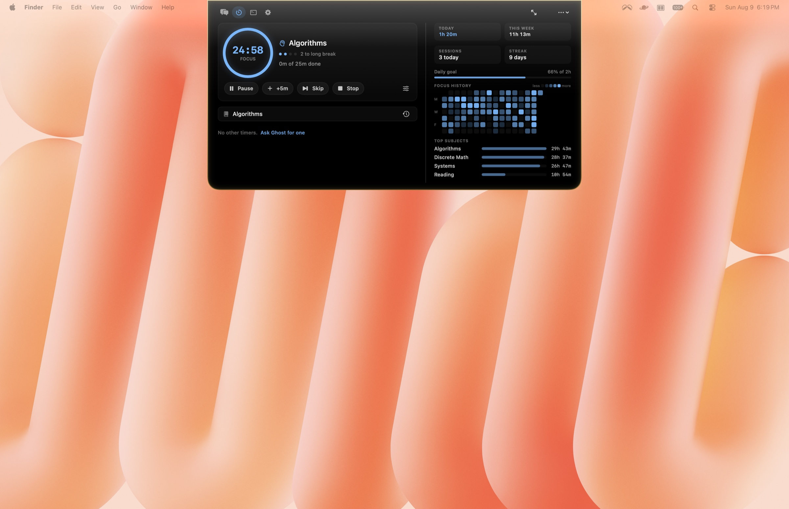

Every completed phase is written to a study log on disk, and the right half of the section is the record built from it — time studied today and this week, sessions completed, current streak, progress against a daily goal, a fifteen-week heatmap, and where the hours actually went by subject. The log never leaves the machine, and it is deliberately never handed to a model as context.

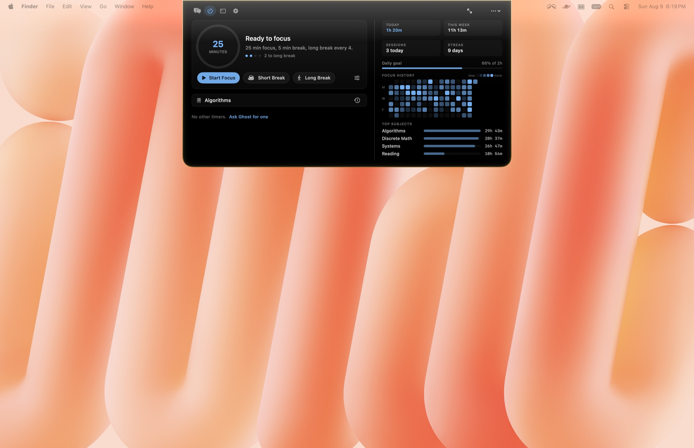

<br/>

## Rewrite anything, anywhere.

<sub><samp>SELECT TEXT · THE BAR COMES TO YOU</samp></sub>

Select text in any app and a small bar appears beside it: Copy, Search, Answer, Summarize, Fix, with Professional, Casual, Humanize, Explain and Translate one click away — and Ask Ghost or Write email to carry the selection into the main window. The bar adapts to what you selected, so code, prose and email drafts each get the actions that suit them.

The result opens in the bar itself. **Replace** writes it back into the field you selected in through the Accessibility API rather than the clipboard, so that app's own ⌘Z still undoes it. Replace only appears when the field is editable and the action actually produces replacement text — a summary is never pasteable over the paragraph it summarized. Press ⌃⌥Space to bring the bar back, Escape to dismiss it.

Right-click → Services → Ghost still works everywhere too.

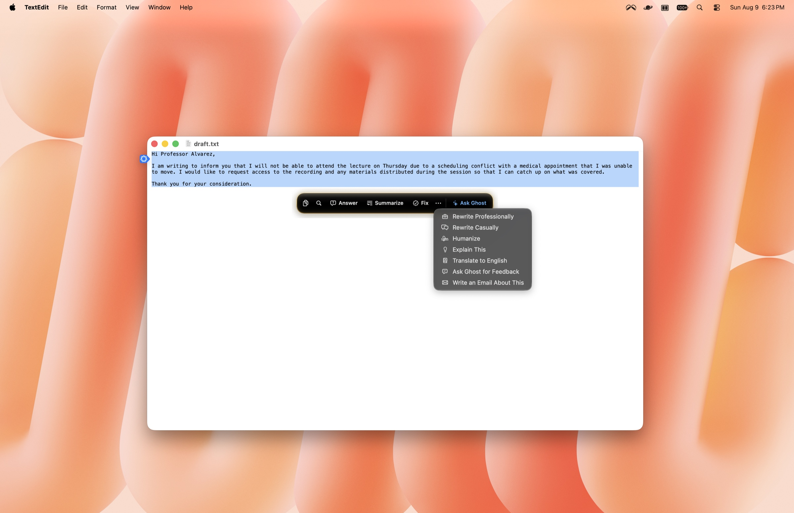

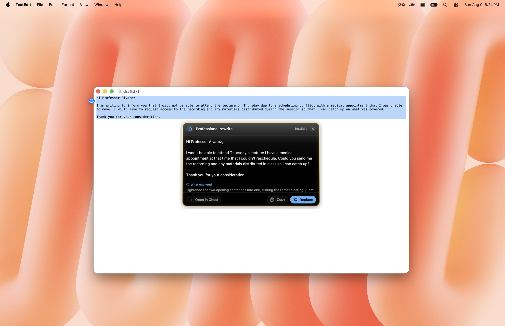

<br/>

## Sections, and a terminal.

<sub><samp>CHAT · TIMER · TERMINAL · SETTINGS</samp></sub>

A bar across the top of the Ghost window switches between sections in one click, and stays put as you move between them. Approval prompts deliberately get no tab — they're decisions to make, not places to go.

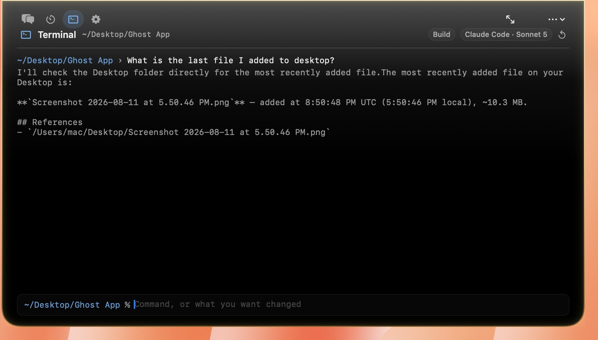

**Terminal** takes both halves of the job. Type a command and it runs: arrow keys walk history, `clear` empties the scrollback, and `cd` carries to the next command. Type what you want changed instead — in plain English — and it goes to Ghost's coding agent, rooted at whatever directory you last `cd`'d to and running on the provider or subscription you already configured. Progress streams as it works, and the agent's own commands (`/plan`, `/build`, `/init`, `/files`) work at the same prompt.

Which of the two you get is decided deterministically, without asking a model, so it can't quietly guess wrong — and you can force either one: prefix a line with `!` to run it as a command, or `>` (or `?`) to send it to the agent. It still runs one command at a time rather than emulating a terminal, so interactive programs like vim or an ssh password prompt aren't supported. It sits behind the same Terminal switch as Ghost's shell tool, off until you turn it on.

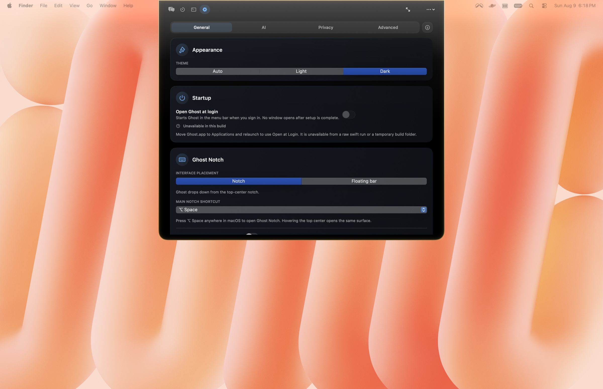

**Timer** is a full pomodoro: start a focus phase, name the subject, and Ghost runs the cycle and keeps the study record beside it. Plain countdowns live there too.

<br/>

## The privacy flex.

<sub><samp>EIGHT GUARANTEES · BUILT SO WE DON'T GET A CHOICE</samp></sub>

Ghost is local-first by design. Here's the machinery:

1. **Your personal data stays on your Mac.** Messages, Notes, Mail, and Contacts are on-device only. Ghost's own tools and memory refuse to send them to a cloud model — for answers, memory, or tools. The one exception is text _you_ select and act on: Summarize can't work unless the model may read it, so the bar names the source app and the provider before you press anything. Use a local model to keep it on the machine.
2. **The selection itself is checked, not just where it came from.** Before an instant action runs on a cloud model, Ghost scans the selected text for a payment card number (validated against the checksum every real card satisfies), a US Social Security number, and a passport number, and folds anything it finds into that same notice. It checks those three and nothing else, so treat it as a backstop rather than a guarantee that everything private gets caught.
3. **API keys live in the macOS Keychain.** Ghost will read one from `~/.ghost/.env` or the process environment if that is where you left it, but only to migrate it into the Keychain, chmod the file to `0600` and strip the value from it. It only reads a key when calling that provider.
4. **Local providers can't launch agent mode.** Ollama and LM Studio stay inside Ghost's managed Direct API tool loop. No escape hatch.
5. **Web egress is guarded.** Localhost, private IPv4/IPv6, link-local, multicast, and reserved addresses are blocked. DNS resolution checks every address; redirects to private destinations are rejected.
6. **Sensitive paths require explicit consent.** Before touching `.ssh`, `.gnupg`, `.aws`, `login.keychain`, `.kube/config`, or `.env`, Ghost prompts: Allow Once, Always This Session, or Deny.
7. **Actions ask first, and can be undone.** High-risk and irreversible actions always confirm, and file changes are journaled and reversible.
8. **Everything starts off.** Web, files, automation, messaging, screen, and shell are all disabled on first launch. You opt in one switch at a time.

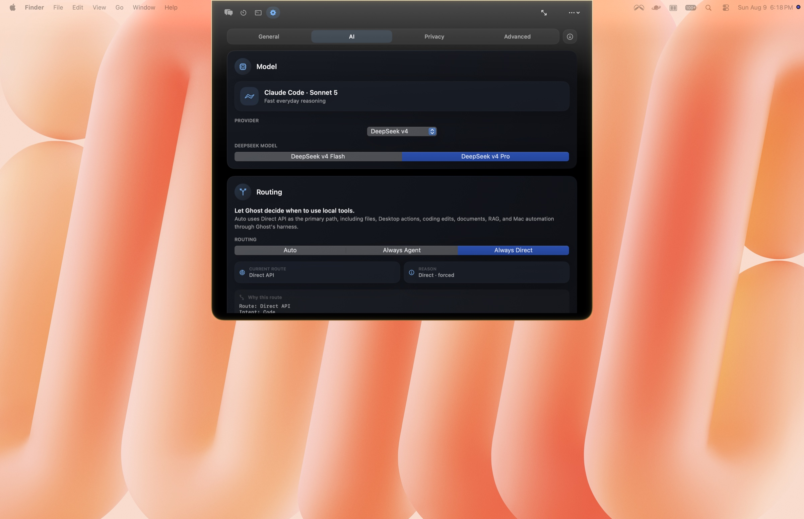

<br/>

## Questions, answered.

<details>
<summary><b>How is Ghost priced? What's the catch?</b></summary>
<br/>

Free 24-hour trial, then a one-time $14.99 lifetime license. No subscriptions, no recurring charges, no hidden costs. Bring your own API keys for hosted models, run your existing Claude/ChatGPT plan through the CLI, or use Ollama and LM Studio for free forever.

</details>

<details>
<summary><b>Do I need to pay for AI models too?</b></summary>
<br/>

Local models (Ollama, LM Studio) run entirely on your machine and cost nothing. Hosted models (Claude, Gemini, DeepSeek, OpenCode Go, OpenCode Zen, any OpenAI-compatible server) need your own API keys — you pay those providers directly at their usage rates, not through Ghost. You can also point Ghost at your existing Claude Code or Codex subscription and run chat through it at no extra cost. Ghost itself is just the workspace.

</details>

<details>
<summary><b>What actually leaves my Mac?</b></summary>
<br/>

Your most personal data — Messages, Notes, Mail, Contacts — never leaves your Mac for a cloud model, ever. When using local models: nothing leaves at all. When using hosted models: your prompt and any attached files go to that provider's API, governed by their privacy policy — the same one your account already lives under. Your knowledge base, RAG index, and API keys never leave your Mac. Web search fetches public pages through Ghost's egress guard; screenshots sent for OCR go to Apple's on-device Vision framework, not a cloud service.

</details>

<details>
<summary><b>Notch or floating bar?</b></summary>
<br/>

Both. On a notch Mac, Ghost drops from the camera notch and the typing pill sits flush just below it. Prefer it elsewhere? Switch to the floating bar and Ghost becomes a clean, high-contrast text field near the bottom of the screen. Pick whichever fits your setup in Settings; the shortcut summons either one.

</details>

<details>
<summary><b>What Macs does it run on?</b></summary>
<br/>

macOS 14 or later, Apple Silicon. Ghost ships as an Apple Silicon build and does not run on an Intel Mac. It is a native SwiftUI app notarized by Apple. Local model inference performance depends on your hardware; LM Studio and Ollama manage their own resource usage independently of Ghost.

</details>

<details>
<summary><b>Can I use Ghost for coding?</b></summary>
<br/>

Yes — Ghost Code offers four agent modes: Plan (inspect and propose), Build (edit files and run commands), Explore (read and map a codebase), and Review (inspect diffs and catch bugs). Coding runs in Ghost's Terminal section, at full width, with the whole change shown the way an editor shows it: every added and removed line, coloured by language, with Undo and Reveal cards beside the code that made them. A live phase line says what the agent is doing while it does it, and you can drive the whole thing with your own Claude Code or Codex plan.

</details>

<br/>

## Fixed: builds 2.0.1 – 2.0.5 stopped telling you about updates.

<sub><samp>AFFECTS 2.0.1 – 2.0.5 · FIXED IN 2.0.6 · CURRENT RELEASE 3.0.0</samp></sub>

**2.0.6 restored both surfaces: updates are presented again when one is found, and Settings carries a Check for Updates button beside the version number.** The current release, 3.0.0, includes that fix. Nothing about this was ever a risk to your Mac; Ghost simply went quiet about its own updates.

If you are running Ghost 2.0.1 through 2.0.5, **your copy will not tell you that 3.0.0 exists, and it has no button to ask with.** The fix cannot reach you through the thing it fixes — you have to install it once by hand, and it works normally from then on.

What happened: the "Check for Updates" button and the "update available" notice both lived in an older window that was removed in July when it stopped being part of the app. The updater underneath kept working the whole time — it checks on schedule and it does find new versions — but it had been told that Ghost would display what it found, and after the removal Ghost had nowhere to display it. So an affected build checks, finds an update, and says nothing.

What to do, if you are on 2.0.1 – 2.0.5:

- **If you turned on automatic downloading and installing**, you are already fine — Sparkle installs new versions without needing anything from Ghost's interface, so 3.0.0 will arrive on its own.
- **Otherwise you will never be prompted, including if you only enabled automatic _checking_.** Checking is what most people turned on, and a check is exactly what these builds swallow. Download 3.0.0 by hand from **[integratedagentics.com/ghost](https://integratedagentics.com/ghost)** or the [releases page](https://github.com/ryuhemingway/Ghost-App/releases/latest), both of which serve the newest release.

<br/>

<br/>

## Under the hood.

<sub><samp>SWIFTUI · APPKIT · SPARKLE · SQLITE</samp></sub>

Ghost is a native macOS app, not Electron, not a web wrapper.

- **The interface.** <samp>NSVisualEffectView glass · notch or floating bar · reactive aurora background · HK Grotesk + Source Serif Pro · spring animations</samp>
- **The routing engine.** <samp>14 intent kinds · eight providers plus BYO Claude/ChatGPT plan · 4 effort levels · 3 approval modes · auto agent-vs-direct routing</samp>
- **The model probe.** <samp>tests every local model for chat, JSON mode, native tool calls, and argument accuracy · assigns the safest calling convention</samp>
- **Memory.** <samp>on-device Markdown knowledge base · remember / recall · ambient grounding · semantic recall · lives in ~/Ghost Outputs/Knowledge</samp>
- **The RAG system.** <samp>SQLite + FTS5 · 3,500-char chunks · 500-char overlap · sentence-aware · page numbers from PDFs · FSEvents watcher · 30+ formats</samp>
- **The harness.** <samp>76 tools · 4 risk tiers · undo journal · path normalization · permission gating · verified writes · three-state outcomes · approval-gated computer-use</samp>
- **Privacy engine.** <samp>on-device-only gate for Messages / Notes / Mail / Contacts · card / SSN / passport scan before cloud egress · web egress guard · Keychain-stored keys · sensitive-path consent</samp>
- **The experience details.** <samp>trackpad haptics on summon and answer · daily brief · proactive suggestions · latency sparkline · token & cost meter · diagnostics log · Prompt Library · right-click rewrite services</samp>

<br/>

## Metrics, generated from the tree — not typed into the README.

<sub><samp>SWIFT TESTING · LLVM-COV · REGENERATED BY CI ON EVERY PUSH</samp></sub>


&color=yellowgreen>)


Ghost ships a [METRICS.md](METRICS.md) that is generated, not written. `script/metrics.sh` counts the Swift files, the lines, the swift-testing tests, and the registered tools straight from the working tree, and `llvm-cov` produces the coverage numbers after a coverage-enabled test run. CI reruns the whole suite with coverage on every push and regenerates the file, so the numbers can't drift from the code they describe — each row in METRICS.md names the exact command that produced it, and anyone can rerun it:

```sh
swift test --enable-code-coverage   # 1,000+ tests, real pass/fail from the runner
./script/metrics.sh --with-coverage # regenerates METRICS.md + metrics.json
```

And Ghost is not a demo: **20+ people have paid for lifetime licenses**, and their feedback ships. The update-notification fix (2.0.6), the diagnostics log, and the selection content scan (2.5.0) all came out of user reports. Those numbers can't be derived from source code, so they live in `metrics.manual.json` — the one hand-maintained file — and the generator merges it in so the dashboard stays whole.

<br/>

## Who's building this.

I'm Ryu, a solo dev building Ghost because I wanted a Mac AI workspace that didn't force me to juggle six different surfaces just to get through a focused hour. Ghost is the app I wanted to use myself — local-first, notch-native, and one tap away from anywhere.

Say hi: [GitHub](https://github.com/ryuhemingway)

<br/>

---

<div align="center">

**[Download Ghost](https://github.com/ryuhemingway/Ghost-App/releases/latest)** · **[Website](https://integratedagentics.com/ghost)**

<sub><samp>DOCS MIT · APP PROPRIETARY · APPLE-NOTARIZED · <a href="https://integratedagentics.com/ghost">INTEGRATEDAGENTICS.COM/GHOST</a></samp></sub>

</div>
