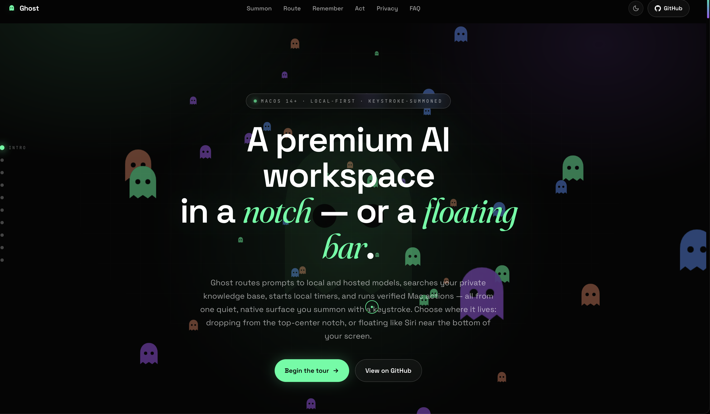
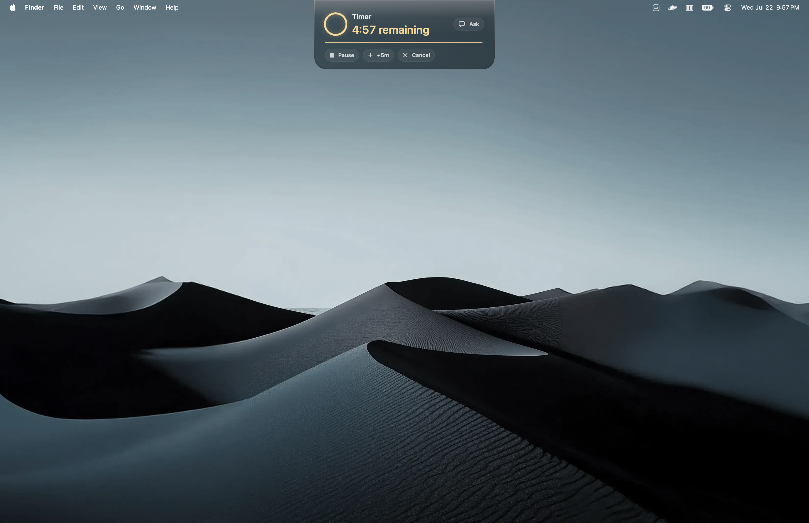

<samp>notarized · one-time purchase · macOS 14+</samp>

 

Every AI tool today has the same problem: you're the one doing all the context switching. ChatGPT tab, local model UI, terminal agent, document viewer, timer app, Calendar — six surfaces just to get through a focused hour of work. Ghost replaces all of them with one surface that lives in your menu bar and opens with ⌥Space.

So you type a question, attach a file, dictate a note, or start a focus timer — and Ghost routes it to the right model, local or cloud, searches your indexed documents, creates real files on your Desktop, and drops back out of sight. No Dock icon, no tab management, no full-screen takeover. Just the work, done.

By default, everything is off: web access, file tools, Calendar, screen capture, shell. You opt in one switch at a time. API keys live in your Keychain, not in a `.env` file. And local models run entirely on your machine with the same tool harness the cloud models get.

 

## One surface, seven providers, zero context switching.

<samp>⌥SPACE · ANYWHERE ON MACOS</samp>

Press ⌥Space anywhere on your Mac and a frosted-glass surface drops from the top center — chat, file creation, document search, timers, Calendar, Reminders, screen OCR, and agent coding sessions all from one place. The aurora background shifts hue with the tone of your conversation. Escape dismisses it.

Ghost routes every prompt through an intent classifier that detects what you're actually trying to do — Answer, Research, Files, Summarize, Screenshot, Create, Organize, Automation, Code, Debug, Review, Shell — then picks the right provider and model. Local models get probed on first launch for tool-calling capability and assigned the safest calling convention they can handle, so even models that can't do native function calls still get access to the harness.

<video src="docs/media/ghost-showcase-main.mp4" controls muted loop width="100%"></video>

 

## Your files, searched locally. No cloud. No embeddings API. No vector DB SaaS.

<samp>SQLITE + FTS5 · 30+ FORMATS · FSEVENTS SYNC</samp>

Ghost indexes folders you approve into a local SQLite database with FTS5 full-text search — 3,500-character chunks with 500-character overlap, sentence-aware splitting, page numbers from PDFs, section titles from markdown. A desktop watcher keeps everything in sync with 8-second debounce. Queries return source-backed chunks with file paths; Ghost opens the exact file at the right line.

30+ formats: txt, md, html, pdf, docx, epub, csv, json, rtf, and every major programming language. Everything stays on your machine.

 

## Real files, not chat bubbles.

<samp>DOCX · PDF · PPTX · XLSX · MARKDOWN · HTML · CSV · JSON</samp>

Ask Ghost to create a file and it writes one — not a code block you copy-paste out of a chat window. Native macOS frameworks generate DOCX, PDF, PPTX, XLSX, Markdown, HTML, CSV, and JSON. Files land in your workspace, Ghost Outputs, Desktop, Downloads, or Documents. Every write is verified; if a model claims a file was saved without a confirmed write, Ghost treats that as an error instead of silently trusting it.

[View the generated solar system demo](docs/media/solar-system-demo.html)

 

## Sixty tools, four risk tiers, one undo journal.

<samp>THE MODEL NEVER TOUCHES YOUR FILESYSTEM</samp>

The capability harness is Ghost's action layer. The model requests an action; Ghost normalizes the path, checks permissions, runs app-owned Swift code, and returns a machine-readable receipt. Over 60 tools span file operations, document generation, Calendar events, Reminders, Apple Notes, Shortcuts, screen capture with Vision OCR, and on-device voice input.

Every tool is classified into four risk tiers — Low (read-only), Medium (writes/creates), High (patches/deletes/shell), and Blocked (unknown tools fail closed). An action journal records before-and-after state for up to 100 entries, so you can roll back any run. Five independent permission switches (web, files, automation, screen, terminal) are all off by default and can be toggled independently.

 

## Timers that mean it.

<samp>DETERMINISTIC · LOCAL · NO MODEL CALLED</samp>

Ask for "a 25 minute focus timer" or "remind me to check the oven in 10 minutes" and Ghost starts a notch countdown — deterministic, local, no model inference. Active timers take over the compact notch. Completed timers reopen with a trackpad haptic. Controls include pause, resume, +5m, restart, cancel, and dismiss.

 

## The privacy flex.

<samp>SIX ELEMENTS · BUILT SO WE DON'T GET A CHOICE</samp>

Ghost is local-first by design. Here's the machinery:

1. **API keys live in macOS Keychain.** Not `.env` files, not plaintext configs. Ghost only reads a key when calling that provider.
2. **Local providers can't launch agent mode.** Ollama and LM Studio stay inside Ghost's managed Direct API tool loop. No escape hatch.
3. **Web egress is guarded.** Localhost, private IPv4/IPv6, link-local, multicast, and reserved addresses are blocked. DNS resolution checks every address; redirects to private destinations are rejected.
4. **Sensitive paths require explicit consent.** Before touching `.ssh`, `.gnupg`, `.aws`, `login.keychain`, `.kube/config`, or `.env`, Ghost prompts: Allow Once, Always This Session, or Deny.
5. **The only deep link is `ghost://toggle`.** No file paths, no user content, no exfiltration vectors.
6. **Everything starts off.** Web, files, automation, screen, and shell are all disabled on first launch. You opt in one switch at a time.

 

## Questions, answered.

<b>How is Ghost priced? What's the catch?</b>

 

Free 2-day trial, then a one-time $10 lifetime license. No subscriptions, no recurring charges, no hidden costs. Bring your own API keys for hosted models or use Ollama and LM Studio for free forever.

<b>Do I need to pay for AI models too?</b>

 

Local models (Ollama, LM Studio) run entirely on your machine and cost nothing. Hosted models (Claude, Gemini, DeepSeek, OpenCode Go, OpenCode Zen) need your own API keys — you pay those providers directly at their usage rates, not through Ghost. Ghost itself is just the workspace.

<b>What actually leaves my Mac?</b>

 

When using local models: nothing. When using hosted models: your prompt and any attached files go to that provider's API, governed by their privacy policy — the same one your account already lives under. Your RAG index and API keys never leave your Mac. Web search fetches public pages through Ghost's egress guard; screenshots sent for OCR go to Apple's on-device Vision framework, not a cloud service.

<b>What Macs does it run on?</b>

 

macOS 14 or later, Apple Silicon or Intel. Ghost is a native SwiftUI app notarized by Apple. Local model inference performance depends on your hardware; LM Studio and Ollama manage their own resource usage independently of Ghost.

<b>Does Ghost work with the lid closed?</b>

 

Ghost is a menu-bar app, so it's available any time your Mac is awake and logged in. Timers run locally and continue counting down in the notch as long as the app is running.

<b>Can I use Ghost for coding?</b>

 

Yes — Ghost Code offers four agent modes: Plan (inspect and propose), Build (edit files and run commands), Explore (read and map a codebase), and Review (inspect diffs and catch bugs). The in-app Agent Console (⌘⇧T) shows an activity timeline with live streaming output.

 

## Under the hood.

<samp>SWIFTUI · APP KIT · SPARKLE · SQLITE</samp>

Ghost is a native macOS app, not Electron, not a web wrapper.

- **The interface.** <samp>NSVisualEffectView blur · noise texture · reactive aurora background · HK Grotesk + Source Serif Pro · spring animations</samp>
- **The routing engine.** <samp>13 intent kinds · automatic provider selection · 4 effort levels (Quick / Balanced / Deep / Max) · 3 approval modes</samp>
- **The model probe.** <samp>tests every local model for chat, JSON mode, native tool calls, and argument accuracy · assigns the safest calling convention</samp>
- **The RAG system.** <samp>SQLite + FTS5 · 3,500-char chunks · 500-char overlap · sentence-aware · page numbers from PDFs · FSEvents watcher · 50K files per pass</samp>
- **The harness.** <samp>60+ tools · 4 risk tiers · 100-entry undo journal · path normalization · permission gating · verified writes</samp>
- **The experience details.** <samp>trackpad haptics on summon and answer · once-a-day welcome-back confetti · latency sparkline · token counter · reasoning depth meter · ⌘K command palette</samp>

 

## Who's building this.

I'm Ryu, a solo dev building Ghost because I wanted a Mac AI workspace that didn't force me to juggle six different surfaces just to get through a focused hour. Ghost is the app I wanted to use myself — local-first, notch-native, and one tap away from anywhere.

Say hi: [GitHub](https://github.com/ryuhemingway)

 

---

**[Download Ghost](https://github.com/ryuhemingway/Ghost-App/releases/latest)** · **[Website](https://integratedagentics.com/ghost)**

<samp>MIT · APPLE-NOTARIZED · <a href="https://integratedagentics.com/ghost">INTEGRATEDAGENTICS.COM/GHOST</a></samp>

