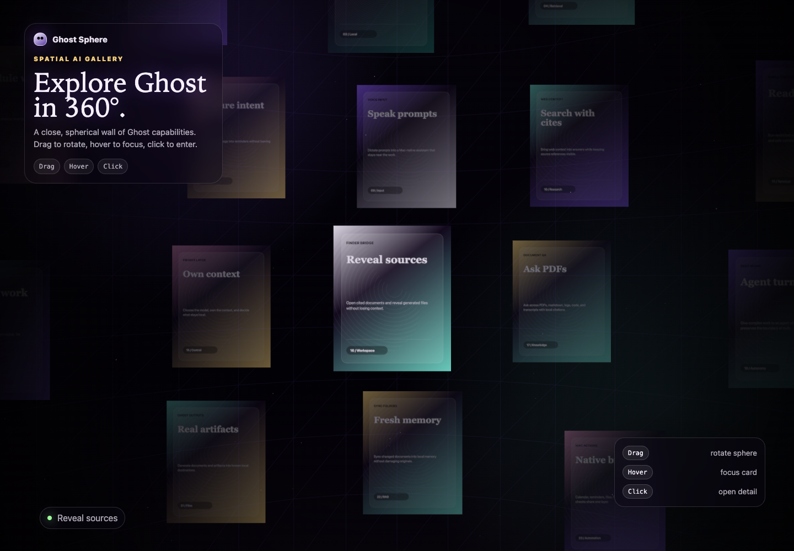
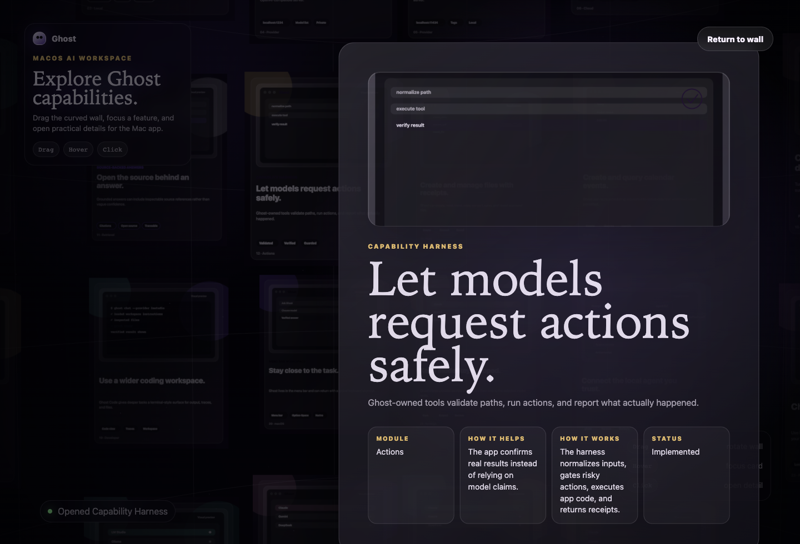
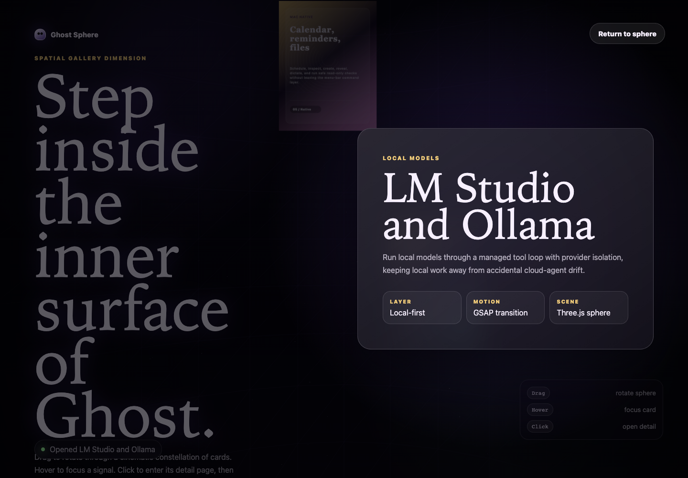
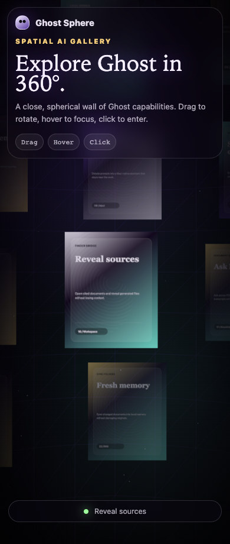

# Ghost Sphere Gallery Demo

An immersive 3D gallery experience for Ghost, built with **Three.js** and **GSAP**. The viewer stands inside a dense, front-biased spherical gallery where Ghost capability cards sit close, readable, and layered across curved latitude bands.

The interaction is inspired by the premium spatial feel of [Phantom](https://www.phantom.land/) without copying its exact design.

## Overview

The gallery is a static marketing/demo surface for the Ghost macOS app:

- The camera feels placed inside a spherical card environment.
- Cards are distributed across a close inner-dome formation.
- Pointer and touch dragging use smooth inertial easing.
- Hovered or centered cards scale and brighten while surrounding cards subtly dim.
- Clicking a card opens a GSAP-animated detail template.
- Returning from detail restores the 3D scene without a reload.

## Features

- Full-screen Three.js scene
- Dense spherical/dome-like card placement
- Smooth drag rotation with inertial decay
- Responsive desktop and mobile layout
- Raycast hover and click interactions
- GSAP detail-page transitions
- Generated glass-style card imagery using canvas textures
- Static hosting through `docs/` for GitHub Pages

## Tech Stack

- **Three.js** for the 3D scene, camera, cards, raycasting, and rendering
- **GSAP** for card focus and detail-page animation
- **Vanilla HTML/CSS/JS** for the shell, HUD, controls, and overlay

Dependencies are loaded in `docs/index.html` through an import map:

```html
"three": "https://unpkg.com/three@0.165.0/build/three.module.js"
"gsap": "https://esm.sh/gsap@3.12.5"
```

## Screenshots










Screenshots are stored in:

```text
docs/screenshots/
```

## Installation

No package installation is required for the gallery. The app is a static site and loads Three.js and GSAP from CDN.

Clone the repository:

```bash
git clone https://github.com/ryuhemingway/Ghost-App.git
cd Ghost-App
```

## Usage

Run the gallery locally:

```bash
python3 -m http.server 4173 --directory docs
```

Open it in the browser:

```text
http://127.0.0.1:4173
```

Controls:

- **Drag with mouse or touch:** rotate the gallery around the viewer.
- **Release after dragging:** inertia continues the motion with eased decay.
- **Hover a card:** the card scales and brightens.
- **Click a card:** animate into the detail template.
- **Return to sphere:** click **Return to sphere**.
- **Keyboard:** press `Esc` to close the detail page.

## Project Structure

```text
docs/
  index.html              Static app shell and import map
  styles.css              Premium dark/glass responsive styling
  script.js               Three.js scene, GSAP motion, interactions
  assets/
    ghost-hero.png        Open Graph preview image
  screenshots/
    main-spherical-gallery.png
    focused-card-state.png
    click-transition-state.png
    detail-page-template.png
    mobile-responsive-gallery.png
```

## Customization

Edit gallery content in `docs/script.js`:

```js
const cards = [
  {
    kicker: "Agent Router",
    title: "Direct API or agent depth",
    layer: "Routing",
    copy: "Ghost decides whether the prompt needs a fast model answer...",
    palette: ["#8b5cff", "#73e0d3", "#f4ce7a"]
  }
];
```

Useful tuning points:

- Change `radius` inside `createGallery()` to tighten or widen the inner dome.
- Adjust `baseWidth` and `baseHeight` inside `createGallery()` to resize cards.
- Tune drag feel with the pointer multipliers, velocity values, and decay values in `tick()`.
- Modify the dark/glass visual system in `docs/styles.css`.
- Replace generated canvas textures with real image assets if desired.

## Troubleshooting

If the page is blank:

- Serve the gallery through HTTP instead of opening `docs/index.html` directly from the filesystem.
- Confirm the browser can reach the Three.js and GSAP CDN URLs.
- Open Chrome DevTools and check the Console tab for network or module-loading errors.

If dragging feels wrong:

- Confirm pointer events are reaching the canvas.
- Test in Chrome with hardware acceleration enabled.
- Lower the renderer pixel ratio in `docs/script.js` if the machine is struggling.
